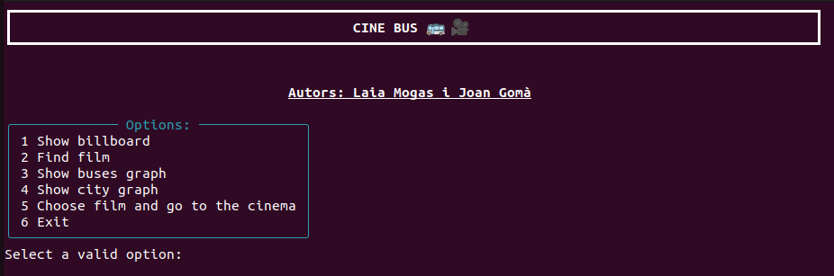
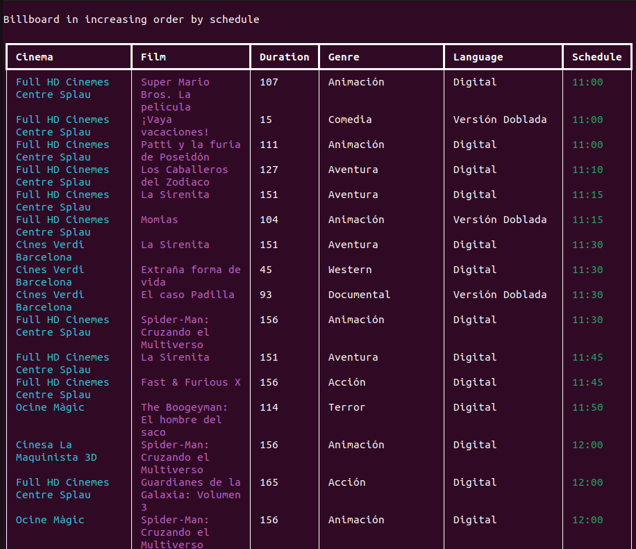
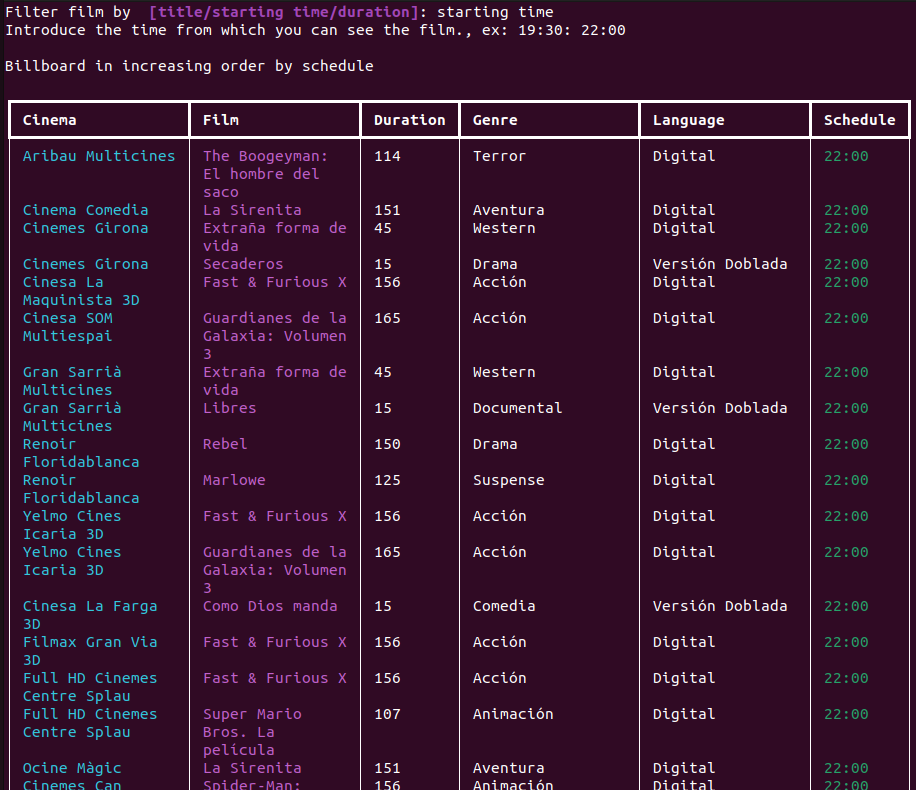
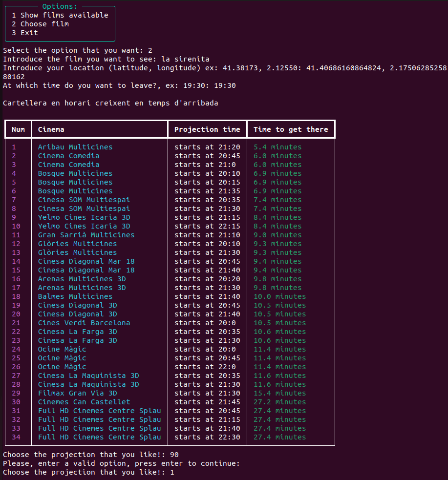
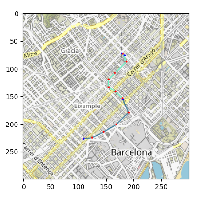

# Cine Bus

Find the movie that best suits your preferences and go there using the Barcelona bus! For now, it is only available in cinemas in Barcelona. We will expand to other areas of Catalonia soon.


## Getting started

The project is divided into the following parts:
- `billboard.py`: retrieves and processes the data from Sensacine related to films, projections and cinemas.
- `buses.py`: downloads the data from the AMB website and generates a graph with th bus stops of Barcelona.
- `city.py`: merges the buses graph with a graph of Barcelona and contains the functions needed to find the shortest path between two coordinates.
- `demo.py`: contains the interface of the application, allowing the user to interact with the different functionalities in a simple and intuitive way.

### Prerequisites
The application uses the following libraries (see the exact version in the `requirements.txt` file):

- `requests` to download data files.
- `beautifulsoup` to parse HTML trees.
- `networkx` to manipulate graphs.
- `osmnx` to obtain graphs of locations (Barcelona in this case).
- `haversine` to calculate distances between coordinates.
- `staticmap` to draw maps.
- `rich` for the terminal application.

All of them can be installed with `pip3 install`. You can use the `requirements.txt` file to install them all at once.

```
pip3 install -r requirements.txt
```

## Usage
Run the `demo.py` file, and then the necessary graphs will be created to calculate the fastest way to get to the cinema. This may take a while. Afterwards, the main menu with all the options will appear. 



### Features of the demo

1. **Show billboard**: View the current billboard displaying a list of films currently being screened in cinemas.



2. **Find film**: Search for a film in the billboard based on its title, duration, or starting time. This feature helps users find specific films that match their preferences. **Note:** It can happen that some films durations are extremely short. This is a problem from the provider of the film data.



3. **Show Buses Graph**: Explore the bus network graph of the city. This feature displays the available bus routes and helps users plan their journey to the cinema by public transportation.

4. **Show City Graph**: Visualize the city graph, which showcases different locations. This feature allows users to familiarize themselves with the city and make informed decisions about their movie-going experience.

5. **Choose Film and Go to the Cinema**: Once users have found a film they want to watch, this option provides guidance on the best route to the closest cinema where the film is being screened. Users can select their preferred film inside this option, and follow the directions to reach the cinema conveniently.




## Authors
Joan Gomà and Laia Mogas.

Data Science and Engineering students at Universitat Politècnica de Catalunya.

## License

This application is licensed under the [MIT License](https://opensource.org/licenses/MIT). Feel free to modify and distribute it as per the terms of the license.

## Contribution

Contributions to the Cine Bus Guide Application are always welcome. If you have any suggestions, bug reports, or feature requests, please submit an issue or create a pull request on the GitHub repository.

We hope you enjoy using the Movie Finder and Cinema Guide Application. Happy movie watching!
